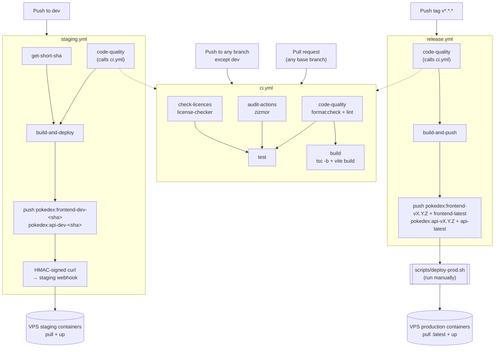

# Pokemons

A Pokémon browser built with React 19 and a local JSON API.

## Stack

| Tool                                                   | Version | Purpose                   |
| ------------------------------------------------------ | ------- | ------------------------- |
| [Vite](https://vite.dev)                               | 8       | Build tool & dev server   |
| [React](https://react.dev)                             | 19      | UI framework              |
| [TypeScript](https://www.typescriptlang.org)           | 5.9     | Type safety               |
| [Tailwind CSS](https://tailwindcss.com)                | 4       | Utility-first styling     |
| [shadcn/ui](https://ui.shadcn.com)                     | —       | Component library         |
| [Zustand](https://zustand-demo.pmnd.rs)                | 5       | Client state (theme mode) |
| [Zod](https://zod.dev)                                 | 4       | Schema validation         |
| [json-server](https://github.com/typicode/json-server) | 1 beta  | Local REST API            |
| [Vitest](https://vitest.dev)                           | 4       | Unit testing              |

**Tooling:** ESLint (strict TypeScript + React rules), Prettier (with Tailwind class sorting), pnpm.

## Prerequisites

- Node.js 18+
- [pnpm](https://pnpm.io) 10 — `npm install -g pnpm`

## Getting Started

```bash
pnpm install

# Terminal 1 — start the JSON API (http://localhost:3000)
pnpm json-server

# Terminal 2 — start the dev server (proxies /api requests to the JSON API)
pnpm dev
```

## Docker (local smoke test)

`docker-compose.yml` spins up the same three-container topology used in staging/production — `gateway` (nginx, routes `/` → `frontend`, `/api/*` → `backend`), `frontend` (nginx serving the built SPA), `backend` (json-server + baked-in `db.json`) — so you can validate the full request path locally before touching the VPS infra:

```bash
docker compose up --build -d

curl http://localhost:8000/                                  # → SPA, 200
curl http://localhost:8000/api/pokemons?_page=1&_per_page=1   # → JSON, via gateway → backend

docker compose down
```

The gateway's host port defaults to `8000`; override with `GATEWAY_PORT`:

```bash
GATEWAY_PORT=9000 docker compose up --build -d
```

Only `gateway` is published to the host — `frontend` and `backend` stay reachable exclusively through it, mirroring how only `gateway` is exposed to the outside on the real VPS deployment (see details about [VPS setup](https://github.com/ddZ6ii/vps-infra/blob/main/docs/vps-setup.md)).

## Contributing

- **Branches:** `dev` is staging, `main` is production (fast-forward only, no merge commits). Create short-lived branches off `dev` using `feat/`, `fix/`, `ci/`, `docs/`, `refactor/`, `perf/`, `test/`, `style/`, or `chore/` prefixes.
- **Workflow:** rebase your branch onto `dev`, open a PR, squash-merge. `dev` → `main` is promoted locally via `git merge --ff-only` — never through a GitHub PR merge.
- **Commits:** Must follow [Conventional Commits](https://www.conventionalcommits.org/) — run `pnpm commit` for an interactive wizard. Allowed types: `feat`, `fix`, `chore`, `ci`, `docs`, `style`, `refactor`, `perf`, `test`, `build`, `revert`. Git hooks (`commit-msg` and `pre-push`) enforce locally; `pre-push` re-validates to catch `--no-verify` bypasses.
- Details: [Branching Strategy](docs/github-branching-strategy.md) · [Linear History Workflow](docs/github-linear-history-workflow.md)

## CI/CD

### Workflows



### Checking audit findings locally

`audit-actions` statically analyzes your workflow files for misconfigurations like script injection or excessive permissions, and blocks `test` on violations — since `staging.yml` and `release.yml` both call `ci.yml`, this also blocks staging deploys and release builds, not just PR merges. Preview zizmor's findings before pushing (requires [`uv`](https://docs.astral.sh/uv/) and the [GitHub CLI](https://cli.github.com/), authenticated via `gh auth login`):

```bash
GH_TOKEN=$(gh auth token) uvx zizmor --config zizmor.yml .
```

Passing a token enables the same "online audit" checks CI runs with (CI runs zizmor with `online-audits: true` and a GitHub token); without one, those checks are silently skipped and a local pass could still fail in CI.

`check-licences` validates dependencies against the license allowlist and blocks `test` on violations — since `staging.yml` and `release.yml` both call `ci.yml`, this also blocks staging deploys and release builds. Check locally with:

```bash
./scripts/check-licences.sh
```

See [`docs/check-licences.md`](docs/check-licences.md) for the full license policy, the current exceptions list, and how to add a new one.

### Deploying to staging (automated)

Push to `dev`:

```bash
git push origin dev
```

`staging.yml` picks it up, runs the `ci.yml` checks, builds + pushes `pokedex:frontend-dev-<short-sha>` and `pokedex:api-dev-<short-sha>` to Docker Hub, and triggers the staging webhook — no manual step needed.

### Deploying to production (manual)

1. Push a `v*.*.*` tag to build + push the release images:

   ```bash
   git tag v1.2.3
   git push origin v1.2.3
   ```

   `release.yml` runs the `ci.yml` checks and pushes `pokedex:frontend-v1.2.3` + `pokedex:frontend-latest` and `pokedex:api-v1.2.3` + `pokedex:api-latest` to Docker Hub — it does **not** deploy anything.

2. Trigger the actual deploy yourself, from `scripts/`:

   ```bash
   scripts/deploy-prod.sh pokedex v1.2.3
   ```

   Requires `WEBHOOK_SECRET_POKEDEX_PROD` set in `scripts/.env` (gitignored — copy `scripts/.env.sample` and fill it in). The script HMAC-signs the request and pulls `frontend-latest`/`api-latest` on the VPS.
